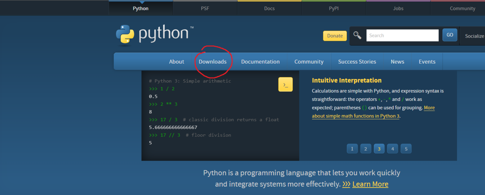
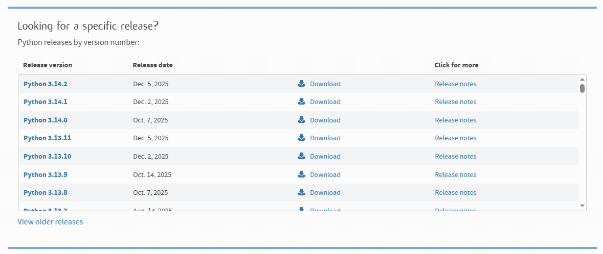
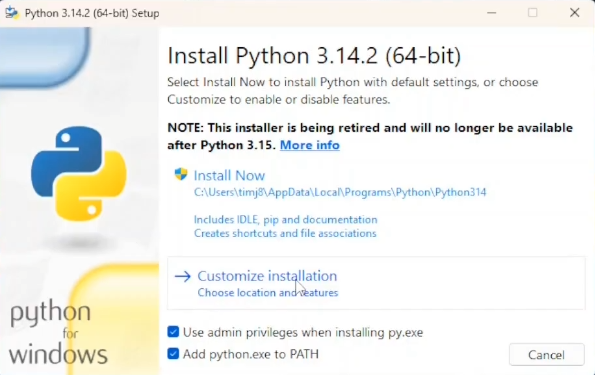
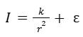

# CPSC-481 Project

This project aims to develop a machine learning model capable of predicting light intensity at
varying distances from a light source. The relationship between light intensity and distance is
governed by the inverse-square law, which states that intensity decreases proportionally to the
square of the distance. However, in real-world conditions, factors such as ambient light, sensor
noise, absoprtions and reflections of light introduce deviations from the ideal model.

## Prerequisites

### Operating System
- Windows 10/11

### Programming Language
- Python 3.14.2

### Python Libraries
- NumPy 2.3.5
- Pandas 2.3.3
- Matplotlib 3.10.7
- scikit-learn 1.7.2

> [!NOTE]
> It is recommended to use the versions stated for programming language and python libraries/packages to run this project.

### Tools
- VS Code
- pip (installed w/ Python)

## Installation

> [!IMPORTANT]
> To run this project, this entire repository assumes that you already have VS Code and are using it.
> To install Python and use Pip, please see below.

### Installing Python and Pip

Head over to Python website and click on Downloads at the top


Then scroll down to find specific release versions of Python. Download Python version 3.14.2. It should look like the following


Once you download it, click on it and you should see a program that pops up. Below inside that program window, check the box
that says "Add python.exe to PATH".


Now click on "Customize Installation" and make sure that "pip" box is checked.
If it is, you may go back and click "Install Now". 
You should now you are ready to start this project!

### Project Setup

If using Git:

```bash
git clone <repository_url>
cd <project_folder>
```

1. Install Dependencies

Run the following line in the terminal to get all the packages required

```bash
pip install numpy pandas scikit-learn matplotlib
```

2. Running the Application

Everything should be setup, so now you can execute the following from the command line

```bash
python main.py
```

Give it a couple seconds and everything should be good!

## Usage

After running the project once through ```main.py```, there should be some PNG files generated within the ```figures/``` directory.
You may click on these images to see some plots from the results of the Linear Regression Model.

- ```intensity_vs_distance``` image shows a graph of how the intensity of light decreases as distance decreases.
- ```intensity_vs_inv_distsqrd``` shows the relationship between intensity and the inverse-squared of distance.
- ```predicted_vs_actual``` shows plots around or near the diagonal red line. If the model is a good fit, the points should lie near the line/slope.
- ```residual_plot``` should show random scatter of points with no pattern or trend. This means Linear Regression is a good fit for the data.

The following light intensity equation is what the model is following


To mess around with the data and see different results, change the parameters of ```generate_light_data()``` in ```main.py```.
The parameters do the following:
- ```n_samples``` (int): generates a certain amount of samples for the synthetic data.
- ```k``` (int): dictates the strength of the light source; proportionality constant.
- ```noise``` (float): adds noise to the data to mess with the equation, skewing the equation away from the theoretical equation.
- ```max_distance``` (int): distance, r, that ranges from [1, max_distance]

Also in the command line, there should be some Regression Metrics printed out.
- ```R^2``` used to assess goodness of fit of a regression model; ranges between 0 to 1, where the higher value the score is, the better fit the model is.
- ```RMSE``` measures accuracy of a predictive model. Quantifies how well predicted values from a model align with the actual observed values.
- ```MAE``` is a measurement of the absolute discrepancies between the actual values and projected values.